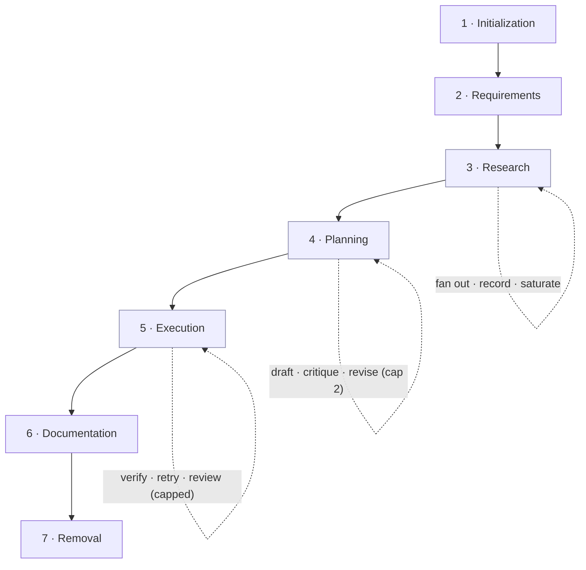

<h1 align="center">🧭 Guided Tour</h1>

<p align="center">
  Turn a vague task into verified code, one checkpointed phase at a time.
</p>

<p align="center">
  
  
  
  
</p>

<p align="center">
  <a href="#quickstart">Quickstart</a> ·
  <a href="#how-it-works">How it works</a> ·
  <a href="#artifacts-and-architecture">Architecture</a> ·
  <a href="#contributing">Contributing</a>
</p>

---

Guided Tour is a workflow skill for AI coding agents (built for [Claude Code](https://docs.claude.com/en/docs/claude-code)). It walks an agent through seven phases, from scoping a task to verifying the result, and writes every intermediate step to disk so the work survives a context reset.

## Table of Contents

- [Why Guided Tour](#why-guided-tour)
- [Features](#features)
- [Quickstart](#quickstart)
- [How it works](#how-it-works)
- [Artifacts and architecture](#artifacts-and-architecture)
- [Design principles](#design-principles)
- [Roadmap](#roadmap)
- [Contributing](#contributing)
- [License](#license)

## Why Guided Tour

AI coding agents forget. They lose context between sessions, skip requirements and jump to code, and write steps that lean on assumptions you cannot see. The result solves the wrong problem or breaks the moment the conversation resets.

Guided Tour fixes this by giving the agent a process and a memory. The process is seven human-gated phases. The memory is a folder of markdown artifacts. Hand any step to a brand-new agent with no history, and it can finish that step from the file alone.

## Features

- **Self-contained steps.** Each step file copies the context it needs, so a fresh agent runs it with zero prior history.
- **Artifacts as memory.** Requirements, research, decisions, and plans live on disk, not in the chat window.
- **Quality loops.** Research, planning, and execution iterate against a real check and stop when it passes.
- **Human-gated checkpoints.** The workflow pauses between phases for your approval and never auto-advances.
- **Resume after reset.** `session.json` records where you stopped; a new session reads it and picks up.

## Quickstart

Clone the skill into your Claude Code skills directory:

```bash
git clone https://github.com/hexcon/Guided-Tour.git ~/.claude/skills/guided-tour
```

Then invoke it from Claude Code, by command or in plain language:

```text
/guided-tour start a rate limiter for the API
```

Here is what a run looks like:

```text
You:  /guided-tour start a rate limiter for the API

Phase 1  Creates a session folder under .claude/workflows/guided-tour/artifacts/
Phase 2  Asks what you are building, then batches the rest into one round
Phase 3  Researches the codebase with parallel subagents, records the decisions
Phase 4  Writes a step-by-step plan, critiques it, and revises before you approve
Phase 5  Executes each step, runs its test, and reviews the whole diff at the end
Phase 6  Writes the docs you keep
Phase 7  Cleans up the session
```

The workflow stops at every phase boundary and waits for you. Say `status` to see where a session stands, `back` to revisit a phase, `pause` to save and exit, or `abort` to discard.

## How it works

Seven phases run in order. Each one produces artifacts, and each transition waits for your approval.



The phase order stays linear and human-gated. The work *inside* phases 3, 4, and 5 runs in loops:

- **Research (3)** fans independent questions out to parallel subagents, records each answer, and stops once a round adds nothing that changes a decision.
- **Planning (4)** drafts the plan, has a fresh context critique it for blocking gaps, and revises. Capped at two passes.
- **Execution (5)** runs each step test-first, closes the step only when its check passes, diagnoses failures before retrying, and reviews the whole diff at the end.

### Loop Discipline

Every loop follows three rules, so it sharpens the work instead of churning it:

1. **Cap the iterations.** Each loop states a maximum. Hitting it is the fallback exit, not the normal one.
2. **Exit on convergence.** Stop the moment the check passes or the critic finds no blocking gap.
3. **Make "done" checkable.** Prefer a signal the agent can run (tests, build, linter) over its own "looks done" judgment.

A loop closes only when the agent has run the check and read the output. "Should pass now" does not count.

## Artifacts and architecture

Each session writes to a folder in your **project** directory, not in the skill itself:

```text
{project-root}/.claude/workflows/guided-tour/artifacts/{NNN}-{slug}/
├── session.json          # Current phase, step, and status
├── requirement.md        # Scoped problem, success criteria
├── research/
│   ├── {topic}.md        # Findings per topic
│   ├── decisions.md      # Choices with rationale
│   ├── notes.md          # Discoveries during execution
│   └── summary.md
├── plan.md               # Steps, dependency graph, critique
├── steps/
│   └── step-{NNN}.md     # Self-contained step files
└── execution-log.md      # Per-step result and the check that closed it
```

The skill repository itself:

```text
├── SKILL.md              # Canonical routing, transitions, Loop Discipline
├── GUIDED-TOUR.md        # Named overview that points to SKILL.md
├── phases/01-07          # Instructions per phase
├── templates/            # Output formats (requirement, plan, step, log)
└── references/
    ├── step-format.md        # Self-containment specification
    ├── research-fanout.md    # Subagent dispatch contract
    ├── plan-critique.md      # Plan review contract
    └── session-schema.json   # JSON schema for session state
```

## Design principles

1. **Never auto-advance.** Every phase transition waits for your approval.
2. **Copy, don't reference.** Steps carry their context inline, with no cross-file dependencies at execution time.
3. **Artifacts are the source of truth.** Not chat history, not memory, not assumptions.
4. **Fail gracefully.** Every step has a rollback. Failures get diagnosed before they get retried, and retries are capped.
5. **You stay in control.** The agent does the work; you approve the direction.
6. **Verify against a check, not a vibe.** A loop closes on observed output and exits on convergence.

## Roadmap

- [x] Seven-phase workflow with human-gated checkpoints
- [x] Self-contained step files and artifact memory
- [x] Quality loops in research, planning, and execution
- [ ] Commit a `LICENSE` file
- [ ] Ship a worked example session in the repo
- [ ] Optional hook-enforced checks for the execution verify loop

## Contributing

Guided Tour is a skill, so changes are documentation changes. Edit `SKILL.md`, the phase files, the templates, or the references, then test the change the way you would test code: run the skill on a real task and confirm an agent follows it.

Issues and pull requests are welcome at [github.com/hexcon/Guided-Tour](https://github.com/hexcon/Guided-Tour). Keep prose tight, keep each phase scannable, and ground new loops in the Loop Discipline rules.

## License

Released under the MIT License.
